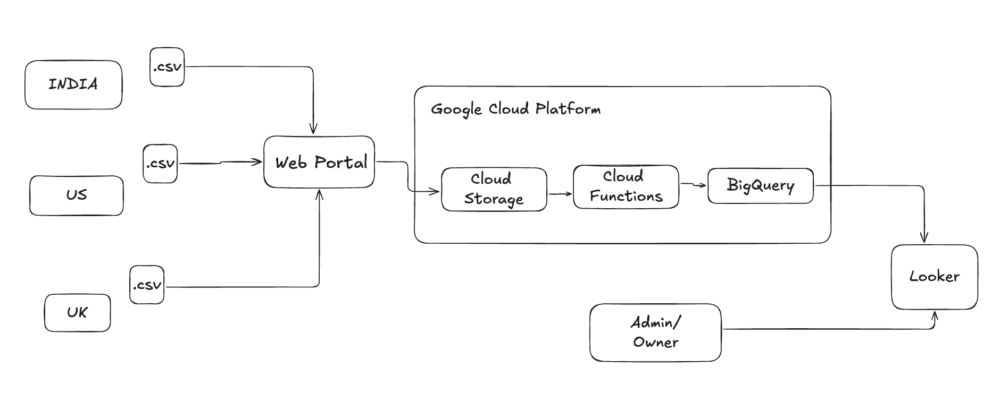

# Sales Data Management & Reporting Pipeline

This project demonstrates the integration of several GCP (Google Cloud Platform) services to create an efficient and automated data pipeline for sales data management and reporting.

## Overview

The system is designed to handle sales data files uploaded from multiple regions (e.g., India, UK, USA), process them through an ETL (Extract, Transform, Load) pipeline, and generate detailed reports using Looker Studio. It automates the entire flow from data upload to visualization.

## Architecture

The architecture consists of the following components:

- **Web Portal**: Built with Python Flask, it allows users to upload sales data files (`IN.csv`, `UK.csv`, `USA.csv`).
- **Google Cloud Storage (GCS)**: Uploaded files are stored in a GCS bucket.
- **Cloud Functions**: Automatically triggered when a file is uploaded to GCS, extracts data from the CSV file, transforms it, and loads it into BigQuery.
- **BigQuery**: Used for querying and analyzing the processed sales data.
- **Looker Studio**: Provides detailed reporting and dashboards with filtering and drill-down capabilities.

## ETL Process

The ETL pipeline is designed to handle raw sales data files uploaded by users and process them into a structured format for analysis and reporting.

- **Extract**: Sales data in CSV format is uploaded via the web portal and stored in GCS.
- **Transform**: Data transformations are applied in the Cloud Function, including data cleaning and formatting to prepare it for loading into BigQuery.
- **Load**: Transformed data is loaded into BigQuery for further analysis.

## Reporting and Visualization

Once the data is processed and stored in BigQuery, Looker Studio is used to create dashboards and reports for data visualization. Key features include:

- Summary views of key sales metrics (total revenue, number of sales, etc.).
- Filters to view data by region, product, or time period.
- Drill-down capabilities for more granular data analysis.

## Setup Instructions

### Prerequisites

- A Google Cloud account
- Python 3.x installed
- GCP services enabled: Cloud Storage, Cloud Functions, BigQuery, and Looker Studio
- Flask installed for the web portal

